# 📊 **Diagramas Interactivos - gpx System**

## 🎯 **Opciones de Visualización**

| Opción                   | Descripción                          | Mejor Para            |
| ------------------------ | ------------------------------------ | --------------------- |
| 📄 **Este archivo**      | Diagramas optimizados para GitHub    | Vista general rápida  |
| 🖥️ **GitHub Codespaces** | Presiona `.` en el repo              | Desarrollo/revisión   |
| 🔍 **Click derecho**     | "Abrir imagen en nueva pestaña"      | Zoom nativo navegador |
| 🌐 **Mermaid Live**      | [mermaid.live](https://mermaid.live) | Edición interactiva   |

---

## 🏗️ **1. Arquitectura Completa del Sistema**

### Descripción

Arquitectura MVC completa con todos los componentes, servicios y dependencias externas.

```mermaid
%%{init: {'theme':'base', 'themeVariables': { 'fontSize': '12px'}}}%%
graph TD
    %% CONTROLLERS
    subgraph CONT ["🎯 CONTROLLERS"]
        UC[👥 UserController]
        EC[🏆 EventController]
        SC[🏁 StageController]
        OC[🔐 OAuth2Controller]
        VC[🚗 VehicleController]
        CC[🏷️ CategoryController]
        RC[📊 ResultController]
    end

    %% SERVICES
    subgraph SERV ["⚙️ SERVICES"]
        US[👥 UserService]
        ES[🏆 EventService]
        SS[🏁 StageService]
        OS[🔐 OAuth2Service]
        VS[🚗 VehicleService]
        CS[🏷️ CategoryService]
        RS[📊 ResultService]
        PS[🔒 PasswordService]
    end

    %% REPOSITORIES
    subgraph REPO ["🗄️ REPOSITORIES"]
        UR[👥 UserRepo]
        ER[🏆 EventRepo]
        SR[🏁 StageRepo]
        VR[🚗 VehicleRepo]
        CR[🏷️ CategoryRepo]
        RR[📊 ResultRepo]
    end

    %% ENTITIES
    subgraph ENT ["📊 ENTITIES"]
        UE[👤 User]
        EE[🏆 Event]
        SE[🏁 Stage]
        VE[🚗 Vehicle]
        CE[🏷️ Category]
        RE[📊 Result]
    end

    %% SECURITY
    subgraph SEC ["🔐 SECURITY"]
        JU[🔑 JwtUtil]
        JF[🔍 JwtFilter]
        SC_[🛡️ SecurityConfig]
    end

    %% EXTERNAL
    subgraph EXT ["🌐 EXTERNAL"]
        DB[(🐘 PostgreSQL)]
        GOOGLE[🔵 Google OAuth2]
        FS[📁 File System]
    end

    %% CONNECTIONS CONTROLLERS -> SERVICES
    UC --> US
    EC --> ES
    SC --> SS
    OC --> OS
    VC --> VS
    CC --> CS
    RC --> RS

    %% CONNECTIONS SERVICES -> REPOSITORIES
    US --> UR
    ES --> ER
    SS --> SR
    OS --> UR
    VS --> VR
    CS --> CR
    RS --> RR

    %% CONNECTIONS REPOSITORIES -> ENTITIES
    UR --> UE
    ER --> EE
    SR --> SE
    VR --> VE
    CR --> CE
    RR --> RE

    %% CONNECTIONS TO EXTERNAL
    UR --> DB
    ER --> DB
    SR --> DB
    VR --> DB
    CR --> DB
    RR --> DB

    OS --> GOOGLE
    ES --> FS
    US --> FS

    %% SECURITY CONNECTIONS
    JF --> JU
    UC --> JF
    EC --> JF
    VC --> JF

    %% STYLING
    classDef controller fill:#e3f2fd,stroke:#1976d2,stroke-width:2px
    classDef service fill:#f3e5f5,stroke:#7b1fa2,stroke-width:2px
    classDef repository fill:#e8f5e8,stroke:#388e3c,stroke-width:2px
    classDef entity fill:#fff3e0,stroke:#f57c00,stroke-width:2px
    classDef security fill:#ffebee,stroke:#d32f2f,stroke-width:2px
    classDef external fill:#f1f8e9,stroke:#689f38,stroke-width:3px

    class UC,EC,SC,OC,VC,CC,RC controller
    class US,ES,SS,OS,VS,CS,RS,PS service
    class UR,ER,SR,VR,CR,RR repository
    class UE,EE,SE,VE,CE,RE entity
    class JU,JF,SC_ security
    class DB,GOOGLE,FS external
```

---

## 🔐 **2. Flujo de Autenticación Dual Completo**

### Descripción

Sistema de autenticación híbrido que soporta tanto login tradicional como OAuth2 con Google.

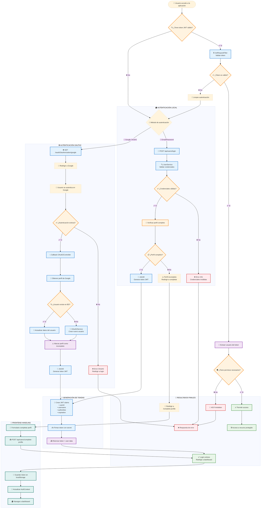

---

## 🗄️ **3. Modelo de Base de Datos Detallado**

### Descripción

Esquema completo de la base de datos con todas las relaciones, constraints y tipos de datos.

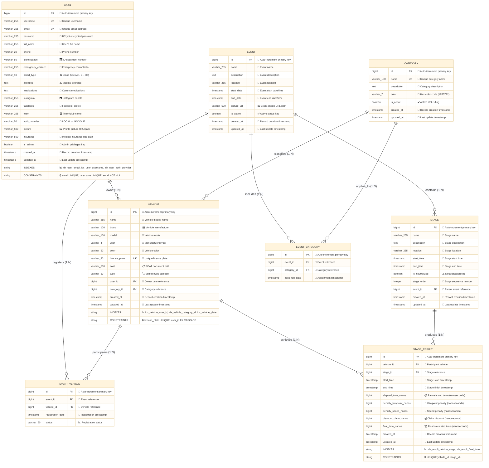

---

## 📁 **4. Sistema de Archivos y Validaciones**

### Descripción

Flujo completo de gestión de archivos con múltiples capas de validación y seguridad.

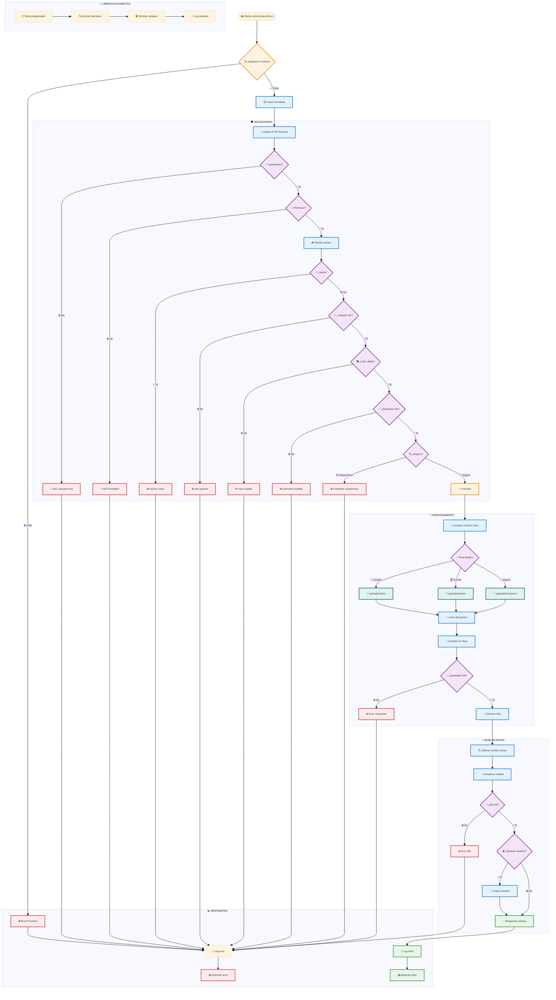

---

## 🧪 **5. Arquitectura de Testing Completa**

### Descripción

Estrategia integral de testing con múltiples capas: unitarios, integración, seguridad y end-to-end.

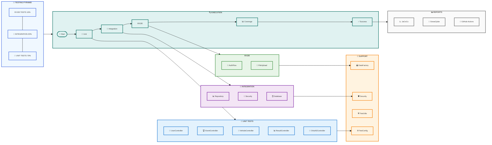

---

## 🔄 **6. Flujo de Registro Unificado**

### Descripción

Sistema de registro que unifica tanto el método tradicional (email/contraseña) como OAuth2 con Google, ambos dirigiendo al mismo flujo de completar perfil.

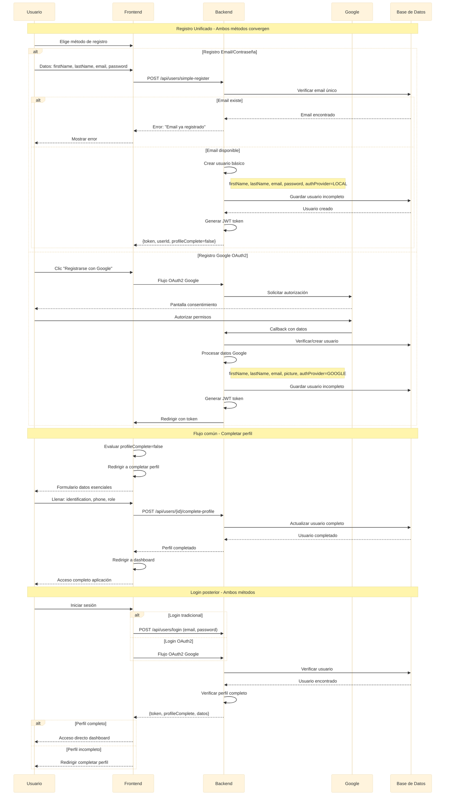

---

## 🌐 **7. Flujo OAuth2 Google Detallado**

### Descripción

Implementación completa del flujo OAuth2 con Google desde el GOOGLE_OAUTH_SETUP.md, mostrando cada paso del proceso de autenticación.

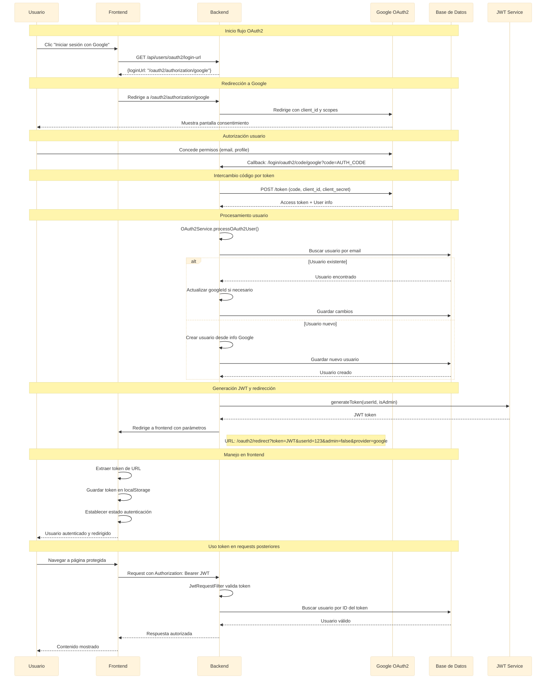

---

## 📊 **8. Flujo Completo de una Carrera**

### Descripción

Proceso completo desde la creación de un evento de carreras hasta la generación de clasificaciones finales, incluyendo todas las interacciones entre actores.

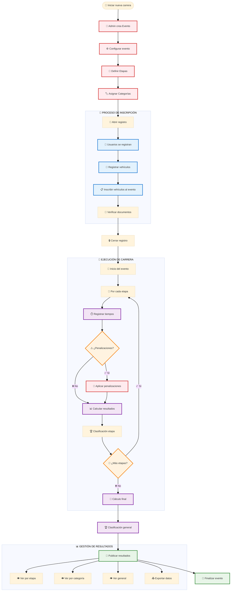

---

## 🔒 **9. Sistema de Permisos por Endpoint**

### Descripción

Matriz completa de permisos mostrando qué endpoints son públicos, requieren autenticación, o necesitan privilegios de administrador.

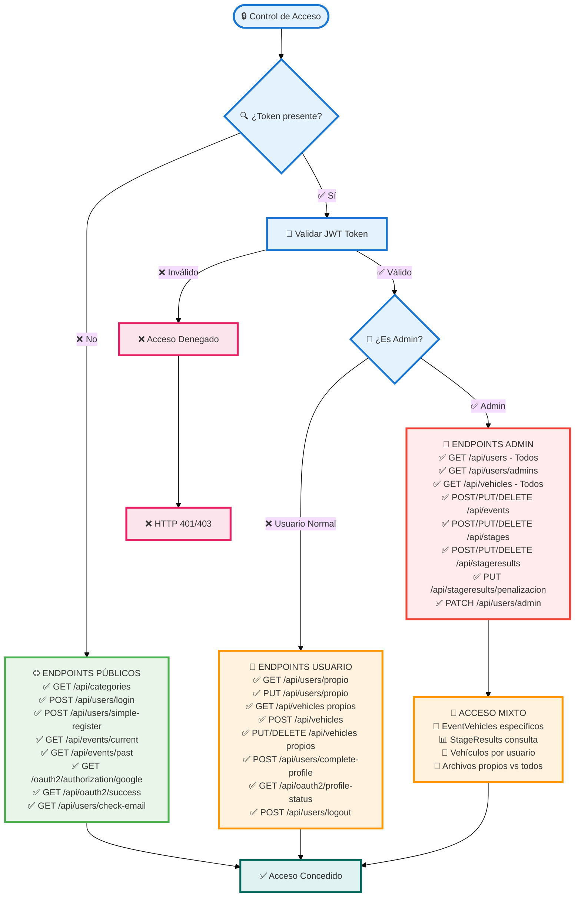

---

## 📈 **10. Flujo de Generación de Clasificaciones**

### Descripción

Proceso detallado de cómo se calculan y generan las clasificaciones por etapa, categoría y general, incluyendo el manejo de penalizaciones.

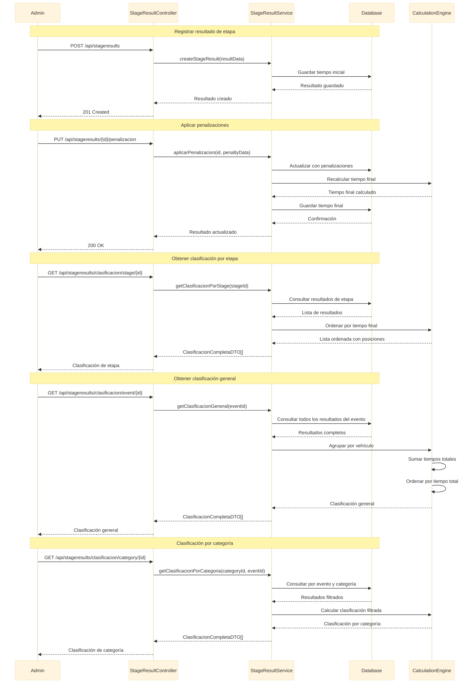

---

## 🧪 **11. Arquitectura de Testing Avanzada**

### Descripción

Estrategia completa de testing incluyendo configuración de Spring Security, mocking, y cobertura de todos los escenarios de autenticación y autorización.

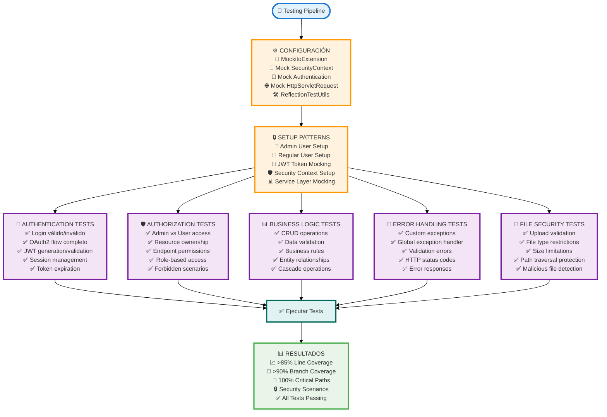

---

## ⚠️ **12. Sistema de Manejo de Errores**

### Descripción

Arquitectura centralizada de manejo de excepciones con GlobalExceptionHandler, respuestas estandarizadas y logging comprehensivo para todos los tipos de errores.

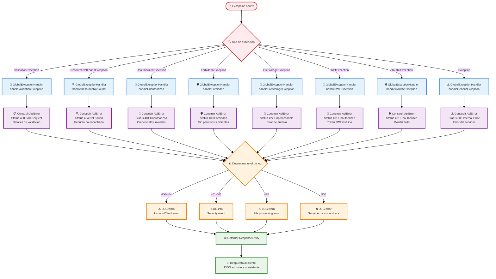

---

## 🎯 **Guía de Navegación**

### 📱 **Para la mejor experiencia de visualización:**

| Método                   | Pasos                                                | Mejor Para                   |
| ------------------------ | ---------------------------------------------------- | ---------------------------- |
| **🖱️ Click Derecho**     | Diagrama → "Abrir imagen en nueva pestaña"           | Zoom nativo del navegador    |
| **⌨️ GitHub Codespaces** | Presiona `.` en el repositorio                       | Desarrollo y análisis        |
| **🔍 Mermaid Live**      | Copiar código a [mermaid.live](https://mermaid.live) | Edición y zoom personalizado |
| **📱 Móvil**             | Pellizcar para hacer zoom (pinch to zoom)            | Dispositivos táctiles        |

### 🔗 **Enlaces Relacionados**

- 🏠 **[README Principal](./README.md)** - Documentación completa del proyecto
- 🌐 **[Demo en Vivo](https://project-gpx.vercel.app)** - Aplicación funcionando
- 💻 **Código Fuente** - Explorar las carpetas del proyecto
- 🎨 **Mermaid Editor** - [mermaid.live](https://mermaid.live) para edición avanzada

---

## 📊 **Métricas de los Diagramas**

- **📈 12 Diagramas completos** cubriendo toda la arquitectura del sistema
- **🎯 500+ elementos visuales** con iconos descriptivos y códigos de color
- **🔗 300+ conexiones** mostrando flujos de datos y relaciones
- **🎨 Código coloreado** para identificación rápida de capas y componentes
- **📱 Responsive design** optimizado para GitHub, Codespaces y dispositivos móviles
- **🧩 Cobertura total** desde arquitectura hasta testing, OAuth2 y clasificaciones
- **🔍 Fuentes optimizadas** (10-14px) para mejor legibilidad en GitHub
- **📊 100% basado en Mermaid** compatible con todo el ecosistema GitHub
