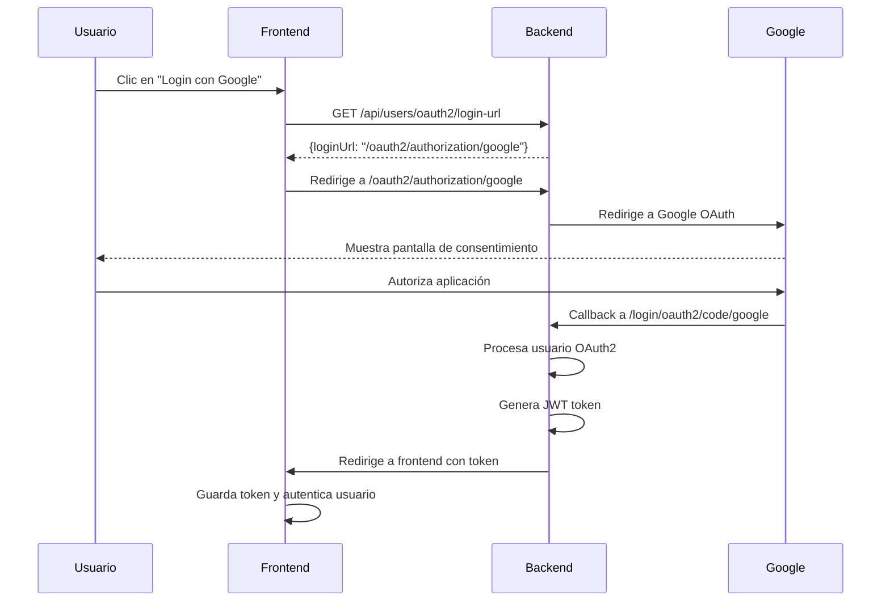

### 7. Flujo completo

```mermaid
sequenceDiagram
    participant U as Usuario
    participant F as Frontend
    participant B as Backend
    participant G as Google

    U->>F: Clic en "Login con Google"
    F->>B: GET /api/users/oauth2/login-url
    B-->>F: {loginUrl: "/oauth2/authorization/google"}
    F->>B: Redirige a /oauth2/authorization/google
    B->>G: Redirige a Google OAuth
    G-->>U: Muestra pantalla de consentimiento
    U->>G: Autoriza aplicación
    G->>B: Callback a /login/oauth2/code/google
    B->>B: Procesa usuario OAuth2
    B->>B: Genera JWT token
    B->>F: Redirige a frontend con token
    F->>F: Guarda token y autentica usuario
```
