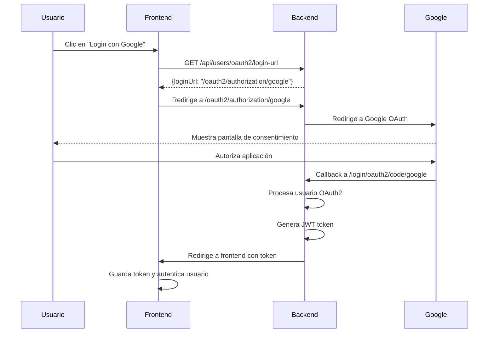

# Configuración de Google OAuth 2.0

## Pasos para configurar Google OAuth 2.0 en tu aplicación

### 1. Crear un proyecto en Google Cloud Console

1. Ve a [Google Cloud Console](https://console.cloud.google.com/)
2. Crear un nuevo proyecto o seleccionar uno existente
3. Habilita la API de Google+ (Google+ API) o People API

### 2. Configurar OAuth 2.0

1. Ve a **APIs & Services > Credentials**
2. Haz clic en **"Create Credentials"** > **"OAuth 2.0 Client IDs"**
3. Selecciona **"Web application"**
4. Configura:
   - **Name**: GPX OAuth Client
   - **Authorized JavaScript origins**:
     - `http://localhost:8080`
     - `http://localhost:3000` (si tienes frontend en React)
   - **Authorized redirect URIs**:
     - `http://localhost:8080/login/oauth2/code/google`

### 3. Configurar variables de entorno

Crea un archivo `.env` en la raíz del proyecto con:

```bash
GOOGLE_CLIENT_ID=tu_client_id_aqui
GOOGLE_CLIENT_SECRET=tu_client_secret_aqui
```

O exporta las variables en tu sistema:

```bash
export GOOGLE_CLIENT_ID=tu_client_id_aqui
export GOOGLE_CLIENT_SECRET=tu_client_secret_aqui
```

### 4. Configurar pantalla de consentimiento OAuth

1. Ve a **APIs & Services > OAuth consent screen**
2. Selecciona **"External"** para usuarios externos
3. Completa la información básica:
   - **App name**: GPX Racing System
   - **User support email**: tu-email@dominio.com
   - **Developer contact information**: tu-email@dominio.com

### 5. Agregar scopes (alcances)

En la configuración de OAuth consent screen, agrega los siguientes scopes:

- `../auth/userinfo.email`
- `../auth/userinfo.profile`

### 6. Endpoints disponibles

Una vez configurado, tendrás disponibles estos endpoints:

#### 🔐 Autenticación (Sistema Unificado):

- **POST** `/api/users/simple-register` - Registro simplificado con datos mínimos
- **POST** `/api/users/login` - Login tradicional (incluye estado del perfil)
- **GET** `/api/users/check-email?email=ejemplo@email.com` - Verificar si email existe

#### 👤 Gestión de perfil y usuarios:

- **PUT** `/api/users/{id}` - Actualizar usuario completo (con archivos)
- **POST** `/api/users/{id}/complete-profile` - Completar datos esenciales del perfil
- **GET** `/api/users/admins` - Obtener usuarios administradores

#### 🌐 OAuth2 con Google:

- **GET** `/api/users/oauth2/login-url` - Obtiene la URL para iniciar OAuth2
- **GET** `/oauth2/authorization/google` - Inicia el flujo OAuth2 (redirige a Google)

#### ⚙️ Backend callbacks OAuth2:

- **GET** `/login/oauth2/code/google` - Callback de Google (manejado automáticamente)
- **GET** `/api/oauth2/success` - Procesa el éxito y redirige al frontend

#### ✅ Gestión de perfil (común para ambos métodos):

- **GET** `/api/oauth2/profile-status` - Verifica si el perfil está completo
- **POST** `/api/users/{id}/complete-profile` - Completa el perfil con campos esenciales

### 7. Flujo completo



### 8. Respuesta del callback

El backend redirigirá al frontend con estos parámetros:

```
http://localhost:3000/oauth2/redirect?token=JWT_TOKEN&userId=123&admin=false&provider=google&profileComplete=false&firstName=Juan
```

### 9. Gestión de perfil incompleto

Los usuarios registrados con Google OAuth2 inicialmente tendrán un perfil mínimo que incluye solo:

- **firstName**: Nombre extraído de Google
- **lastName**: Apellido extraído de Google (si está disponible)
- **email**: Email de Google
- **picture**: Foto de perfil de Google
- **googleId**: ID único de Google
- **authProvider**: "GOOGLE"

**Campos que requieren completar**:

- **identification**: Documento de identidad
- **phone**: Teléfono de contacto
- **role**: Rol en las carreras (piloto, copiloto, etc.)

#### Endpoints para gestión de perfil:

- **GET** `/api/oauth2/profile-status` - Verifica si el perfil está completo
- **POST** `/api/users/{id}/complete-profile` - Completa el perfil con campos esenciales

### 10. Manejo de errores

En caso de error:

```
http://localhost:3000/oauth2/redirect?error=oauth2_failed&message=ERROR_MESSAGE
```

### 11. Uso en el Frontend

#### React/JavaScript ejemplo:

````javascript
// ========== REGISTRO SIMPLIFICADO (NUEVO MÉTODO) ==========
const handleSimpleRegister = async (userData) => {
  try {
    const response = await fetch("/api/users/simple-register", {
      method: "POST",
      headers: {
        "Content-Type": "application/json",
      },
      body: JSON.stringify({
        firstName: userData.firstName,
        lastName: userData.lastName,
        email: userData.email,
        password: userData.password,
      }),
    });

    if (response.ok) {
      const data = await response.json();
      localStorage.setItem("authToken", data.token);

      // Siempre redirige a completar perfil para registro simplificado
      // Ya que profileComplete siempre es false en este endpoint
      window.location.href = `/complete-profile?welcome=${data.firstName}`;
    } else {
      const errorText = await response.text();
      console.error("Error en registro:", errorText);
      // Mostrar error al usuario (email duplicado, campos faltantes, etc.)
    }
  } catch (error) {
    console.error("Error de red:", error);
  }
};

// ========== VALIDACIÓN EN TIEMPO REAL ==========
const checkEmailExists = async (email) => {
  try {
    const response = await fetch(
      `/api/users/check-email?email=${encodeURIComponent(email.trim())}`
    );
    const data = await response.json();
    return data.exists;
  } catch (error) {
    console.error("Error verificando email:", error);
    return false;
  }
};

// ========== LOGIN UNIFICADO (DETECTA ESTADO DEL PERFIL) ==========
const handleLogin = async (credentials) => {
  try {
    const response = await fetch("/api/users/login", {
      method: "POST",
      headers: {
        "Content-Type": "application/json",
      },
      body: JSON.stringify({
        email: credentials.email,
        password: credentials.password,
      }),
    });

    if (response.ok) {
      const data = await response.json();
      localStorage.setItem("authToken", data.token);

      // El backend ya determina si el perfil está completo
      if (data.profileComplete) {
        window.location.href = "/dashboard";
      } else {
        window.location.href = `/complete-profile?welcome=${data.firstName}`;
      }
    } else {
      console.error("Credenciales incorrectas");
      // Mostrar mensaje de error al usuario
    }
  } catch (error) {
    console.error("Error de red:", error);
  }
};

// ========== OAUTH2 CON GOOGLE ==========
const handleGoogleLogin = async () => {
  try {
    // Obtener URL de login de Google desde el backend
    const response = await fetch("/api/users/oauth2/login-url");
    const data = await response.json();

    // Redirigir a Google OAuth2
    window.location.href = data.loginUrl;
  } catch (error) {
    console.error("Error iniciando OAuth2:", error);
  }
};

// ========== MANEJO DEL CALLBACK OAUTH2 ==========
const OAuth2Redirect = () => {
  useEffect(() => {
    const urlParams = new URLSearchParams(window.location.search);
    const token = urlParams.get("token");
    const error = urlParams.get("error");
    const profileComplete = urlParams.get("profileComplete") === "true";
    const firstName = urlParams.get("firstName");
    const provider = urlParams.get("provider");

    if (token) {
      localStorage.setItem("authToken", token);

      if (profileComplete) {
        // Perfil completo, ir al dashboard
        window.location.href = "/dashboard";
      } else {
        // Perfil incompleto, ir a completar perfil
        window.location.href = `/complete-profile?welcome=${firstName}&provider=${provider}`;
      }
    } else if (error) {
      console.error("OAuth2 Error:", error);
      const message = urlParams.get("message");
      // Mostrar error al usuario y redirigir al login
      alert(`Error de autenticación: ${message || "Error desconocido"}`);
      window.location.href = "/login";
    }
  }, []);

  return (
    <div style={{ textAlign: "center", padding: "20px" }}>
      <h3>Procesando autenticación...</h3>
      <div>Por favor espera mientras validamos tu información.</div>
    </div>
  );
};

// ========== COMPLETAR PERFIL (COMÚN PARA AMBOS MÉTODOS) ==========
const CompleteProfile = () => {
  const [profileData, setProfileData] = useState({
    identification: "",
    phone: "",
    role: "piloto",
  });
  const [loading, setLoading] = useState(false);

  // Obtener información del usuario desde URL o token
  const urlParams = new URLSearchParams(window.location.search);
  const welcomeName = urlParams.get("welcome");
  const provider = urlParams.get("provider") || "local";

  const handleCompleteProfile = async () => {
    setLoading(true);
    try {
      const token = localStorage.getItem("authToken");
      const userId = getUserIdFromToken(token); // Implementar esta función

      const response = await fetch(`/api/users/${userId}/complete-profile`, {
        method: "POST",
        headers: {
          "Content-Type": "application/json",
          Authorization: `Bearer ${token}`,
        },
        body: JSON.stringify(profileData),
      });

      if (response.ok) {
        window.location.href = "/dashboard";
      } else {
        const errorText = await response.text();
        console.error("Error completando perfil:", errorText);
        alert("Error al completar el perfil. Por favor intenta de nuevo.");
      }
    } catch (error) {
      console.error("Error:", error);
      alert("Error de conexión. Por favor intenta de nuevo.");
    } finally {
      setLoading(false);
    }
  };

  const isFormValid = profileData.identification.trim() &&
                     profileData.phone.trim() &&
                     profileData.role.trim();

  return (
    <div style={{ maxWidth: "400px", margin: "0 auto", padding: "20px" }}>
      <h2>¡Bienvenido{welcomeName ? `, ${welcomeName}` : ""}! 🎉</h2>
      <p>
        {provider === "google"
          ? "Tu cuenta de Google se ha vinculado exitosamente. "
          : "Tu registro se ha completado exitosamente. "
        }
        Para participar en eventos, necesitamos algunos datos adicionales:
      </p>

      <div style={{ marginBottom: "15px" }}>
        <label>Documento de identidad *</label>
        <input
          type="text"
          placeholder="Ej: 12345678"
          value={profileData.identification}
          onChange={(e) =>
            setProfileData({ ...profileData, identification: e.target.value })
          }
          required
          style={{ width: "100%", padding: "8px", marginTop: "5px" }}
        />
      </div>

      <div style={{ marginBottom: "15px" }}>
        <label>Teléfono de contacto *</label>
        <input
          type="tel"
          placeholder="Ej: 3001234567"
          value={profileData.phone}
          onChange={(e) =>
            setProfileData({ ...profileData, phone: e.target.value })
          }
          required
          style={{ width: "100%", padding: "8px", marginTop: "5px" }}
        />
      </div>

      <div style={{ marginBottom: "20px" }}>
        <label>Tu rol en las carreras *</label>
        <select
          value={profileData.role}
          onChange={(e) =>
            setProfileData({ ...profileData, role: e.target.value })
          }
          required
          style={{ width: "100%", padding: "8px", marginTop: "5px" }}
        >
          <option value="">Selecciona tu rol</option>
          <option value="piloto">Piloto</option>
          <option value="copiloto">Copiloto</option>
          <option value="navegante">Navegante</option>
          <option value="mecanico">Mecánico</option>
          <option value="organizador">Organizador</option>
        </select>
      </div>

      <button
        onClick={handleCompleteProfile}
        disabled={!isFormValid || loading}
        style={{
          width: "100%",
          padding: "12px",
          backgroundColor: isFormValid && !loading ? "#007bff" : "#ccc",
          color: "white",
          border: "none",
          borderRadius: "5px",
          cursor: isFormValid && !loading ? "pointer" : "not-allowed"
        }}
      >
        {loading ? "Guardando..." : "Completar Perfil y Continuar"}
      </button>

      <small style={{ display: "block", marginTop: "10px", color: "#666" }}>
        * Campos obligatorios. Podrás agregar más información desde tu perfil después.
      </small>
    </div>
  );
};

// ========== UTILIDAD PARA EXTRAER USER ID DEL TOKEN ==========
const getUserIdFromToken = (token) => {
  try {
    // Decodificar JWT (solo la parte del payload)
    const base64Url = token.split('.')[1];
    const base64 = base64Url.replace(/-/g, '+').replace(/_/g, '/');
    const jsonPayload = decodeURIComponent(atob(base64).split('').map(function(c) {
      return '%' + ('00' + c.charCodeAt(0).toString(16)).slice(-2);
    }).join(''));

    const decoded = JSON.parse(jsonPayload);
    return decoded.userId; // Ajustar según tu implementación de JWT
  } catch (error) {
    console.error("Error decodificando token:", error);
    return null;
  }
};

## 🎯 Flujo Unificado de Autenticación

### Registro Local (Simplificado):
1. Usuario llena formulario con: firstName, lastName, email, password
2. POST a `/api/users/simple-register`
3. Backend genera JWT inmediatamente
4. Redirige a completar perfil (profileComplete siempre es false)

### Registro con Google OAuth2:
1. Usuario hace clic en "Login con Google"
2. GET a `/api/users/oauth2/login-url`
3. Redirige a `/oauth2/authorization/google`
4. Proceso OAuth2 con Google
5. Callback procesa datos y genera JWT
6. Redirige según estado del perfil

### Login (Ambos Métodos):
1. POST a `/api/users/login`
2. Backend verifica credenciales y estado del perfil
3. Retorna JWT + información del perfil
4. Frontend redirige según `profileComplete`

## Notas importantes

1. **🔒 Seguridad**: Nunca expongas el `client_secret` en el frontend
2. **🌐 HTTPS en producción**: Google requiere HTTPS en producción
3. **🎯 Dominios autorizados**: Actualiza los dominios autorizados cuando despliegues
4. **📱 Scopes mínimos**: Solo solicita los permisos que realmente necesitas
5. **⚡ Experiencia unificada**: Ambos métodos de registro tienen el mismo flujo final

## Verificación

Para verificar que todo funciona:

1. **Inicia la aplicación**: `mvn spring-boot:run`
2. **Prueba OAuth2**: Ve a `http://localhost:8080/api/users/oauth2/login-url`
3. **Respuesta esperada**: `{"loginUrl":"/oauth2/authorization/google","message":"..."}`
4. **Prueba flujo completo**: Navega a `http://localhost:8080/oauth2/authorization/google`
5. **Resultado**: Deberías ser redirigido a Google para autenticarte

### Endpoints de prueba adicionales:

```bash
# Verificar email
curl "http://localhost:8080/api/users/check-email?email=test@ejemplo.com"

# Registro simple
curl -X POST http://localhost:8080/api/users/simple-register \
  -H "Content-Type: application/json" \
  -d '{"firstName":"Juan","lastName":"Pérez","email":"juan@ejemplo.com","password":"password123"}'

# Login
curl -X POST http://localhost:8080/api/users/login \
  -H "Content-Type: application/json" \
  -d '{"email":"juan@ejemplo.com","password":"password123"}'
````
